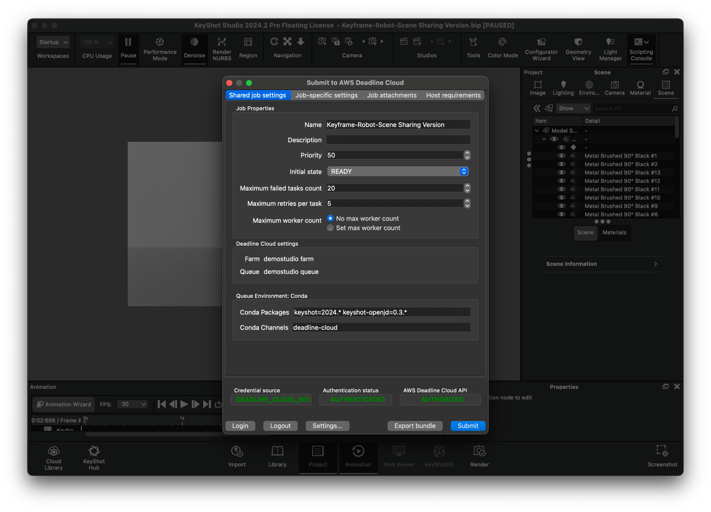

# AWS Deadline Cloud for KeyShot

### [User guide](https://aws-deadline.github.io/) | [Service documentation](https://docs.aws.amazon.com/deadline-cloud/) | [Deadline Cloud on GitHub](https://github.com/aws-deadline/) 

AWS Deadline Cloud for KeyShot is a Python plugin that allows users to create [AWS Deadline Cloud][deadline-cloud] jobs from within KeyShot.

[deadline-cloud]: https://docs.aws.amazon.com/deadline-cloud/latest/userguide/what-is-deadline-cloud.html
[user-guide]: https://aws-deadline.github.io/keyshot/user-guide/

## User guide

For installation and usage instructions, see the [AWS Deadline Cloud integrations user guide][user-guide]. The user guide covers:
- Installing the KeyShot submitter on Windows and macOS
- Submitting rendering jobs to Deadline Cloud
- Configuring job settings and render options

## Requirements

- KeyShot 2023 - 2025
- Windows or macOS workstation for job submission
- Windows worker for job rendering with KeyShot Studio installed and licensed

## Architecture

The integration consists of two main components:

1. **Submitter** (`src/submitter.py`) - A KeyShot script that provides a GUI for submitting jobs to Deadline Cloud. It exports the scene to a KeyShot Package (KSP), extracts assets, and generates an OpenJD job bundle.

2. **Adaptor** - A command-line application that runs on worker hosts to execute KeyShot rendering tasks defined in OpenJD job templates.

See the [ARCHITECTURE.md](ARCHITECTURE.md) for more details.

## Development Setup

See [DEVELOPMENT.md](DEVELOPMENT.md) for instructions on setting up a development environment.

## Manual Installation (Development/Testing)

For development or testing purposes, you can manually install the submitter:

1. Install dependencies: `pip install "deadline[gui]"`
2. Copy `src/deadline/keyshot_submitter/Submit to AWS Deadline Cloud.py` to the KeyShot scripts folder:
    - Windows: `%USERPROFILE%/Documents/KeyShot Studio/Scripts` or `%PROGRAMFILES%/KeyShot Studio/Scripts`
    - macOS: `/Library/Application Support/KeyShot12/` or `/Library/Application Support/KeyShot/`
3. Launch KeyShot and access via `Window > Scripting Console > Scripts > Submit to AWS Deadline Cloud > Run`

## Worker Setup for KeyShot

To run KeyShot jobs on Deadline Cloud, workers must have KeyShot Studio installed and licensed. You can create a KeyShot conda package for your fleet using the [sample in the deadline-cloud-samples repository](https://github.com/aws-deadline/deadline-cloud-samples).

> [!NOTE]  
> The KeyShot adaptor uses TCP ports in the range 9000-9099 for internal communication during rendering. These ports only listen on the loopback interface (127.0.0.1) and do not require network access.

## Contributing

See [CONTRIBUTING.md](CONTRIBUTING.md) for information on reporting security issues and contributing to the project.

## Versioning

This package's version follows [Semantic Versioning 2.0](https://semver.org/), but is still considered to be in its
initial development, thus backwards incompatible versions are denoted by minor version bumps. To help illustrate how
versions will increment during this initial development stage, they are described below:

1. The MAJOR version is currently 0, indicating initial development.
2. The MINOR version is currently incremented when backwards incompatible changes are introduced to the public API.
3. The PATCH version is currently incremented when bug fixes or backwards compatible changes are introduced to the public API.

## Security

See [CONTRIBUTING](https://github.com/aws-deadline/deadline-cloud-for-keyshot/blob/release/CONTRIBUTING.md#security-issue-notifications) for more information.

## Telemetry

See [telemetry](https://github.com/aws-deadline/deadline-cloud-for-keyshot/blob/release/docs/telemetry.md) for more information.

## License

This project is licensed under the Apache-2.0 License.
