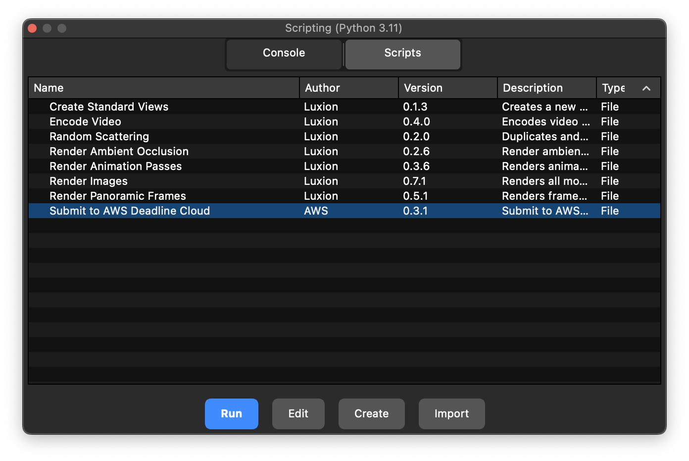
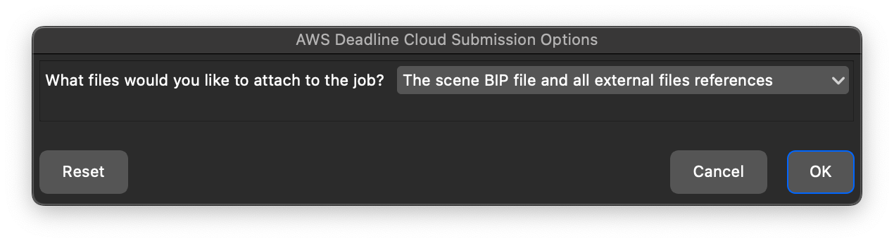
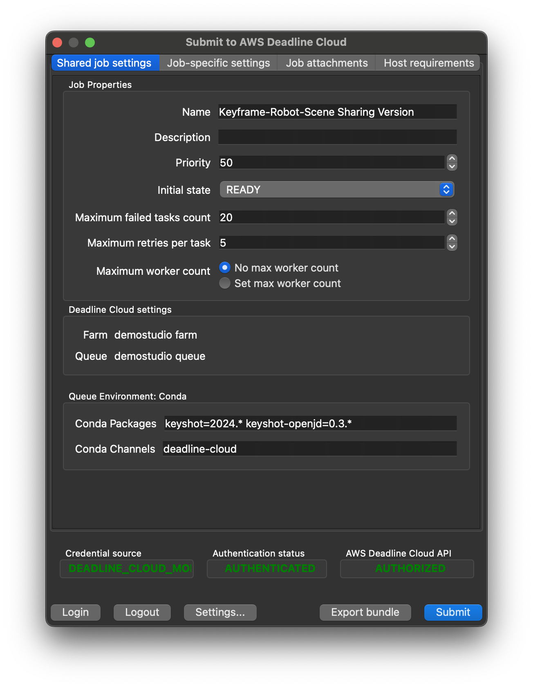
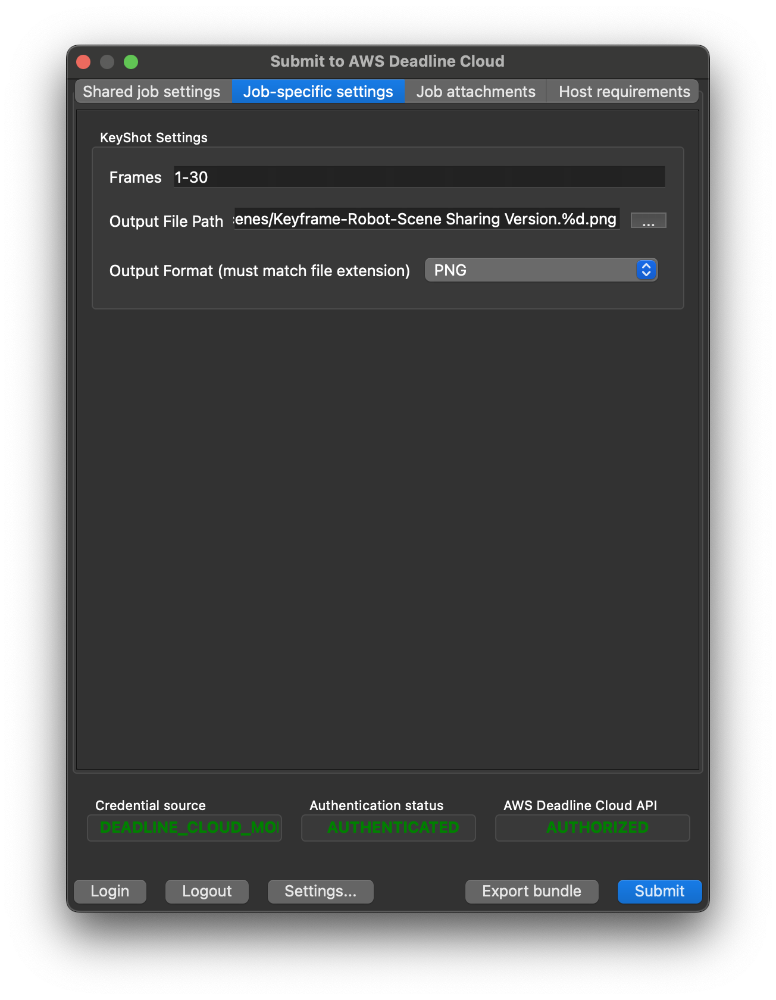

# AWS Deadline Cloud for KeyShot Studio User Guide

This guide provides step-by-step instructions for using AWS Deadline Cloud with KeyShot Studio to render your projects faster by distributing rendering tasks across multiple machines.

## Table of Contents

- [Overview](#overview)
- [Requirements](#requirements)
- [Installation](#installation)
- [Using the Submitter](#using-the-submitter)
  - [Preparing Your Scene](#preparing-your-scene)
  - [Submitting a Job](#submitting-a-job)
  - [Submission Options](#submission-options)
  - [Render Settings](#render-settings)
- [Monitoring Your Jobs](#monitoring-your-jobs)
- [Getting Help](#getting-help)

## Overview

AWS Deadline Cloud for KeyShot Studio allows you to:

- Submit KeyShot rendering jobs to AWS Deadline Cloud directly from within KeyShot Studio
- Distribute rendering tasks across multiple machines
- Monitor job progress and results

## Requirements

Before you begin, make sure you have:

- A Windows or MacOS workstation
- KeyShot Studio 2023 or 2024
- [Deadline Cloud monitor](https://docs.aws.amazon.com/deadline-cloud/latest/userguide/monitor-onboarding.html) installed
- Access to an AWS Deadline Cloud farm with either
    - a Windows service-managed fleet or
    - a customer-managed fleet with KeyShot Studio, the KeyShot adapter, and licensing set up

## Installation

The KeyShot submitter extension allows you to submit jobs to Deadline Cloud directly from within KeyShot. To install the submitter,

1. Download the [official Deadline Cloud submitter installer](https://docs.aws.amazon.com/deadline-cloud/latest/userguide/submitter.html)
2. Run the installer and follow the on-screen instructions
3. Launch KeyShot after installation

> Currently a submitter installer is only availble for Windows. See the [the developer README](../../README.md) for manual install instructions for Mac.

To update the submitter to the latest version, download and run the latest submitter installer.

## Using the Submitter

### Preparing Your Scene

Before submitting a job:

1. Make sure your scene is saved
2. Set up your camera angles, materials, and lighting as desired
3. Configure animation frames if rendering an animation

### Submitting a Job

1. In KeyShot, on the top toolbar click **Scripting Console**.
2. In the Scripting Console, navigate to **Scripts** → **Submit to AWS Deadline Cloud**
3. Click **Run**

### Submission Options

When you run the submitter, you'll first see a dialog asking how you want to handle file attachments:

Choose one of the following options:

- **The scene BIP file and all external files references** (Recommended)
  - Automatically packages your scene file and all referenced files. Internally, the submitter creates a KeyShot Package (KSP) which bundles all linked files and uses relatives paths.
  - Best for scenes with textures, models, and other external assets
  - Ensures workers have all necessary files to render your scene

- **Only the scene BIP file**
  - Only submits the KeyShot scene file
  - Use this option if your workers already have access to all referenced files
  - Requires shared network storage or another method to access external files

### Render Settings

After selecting your submission option, the Deadline Cloud submitter interface will appear:

Configure your render settings:

1. **Shared job settings**

   - **Job Name**: Give your job a descriptive name
   - **If you are using the submitter for the first time**, you may need to set your farm and queue. To set them, click the **Settings** button.
   - **If you're using KeyShot 2023**, Deadline Cloud service-managed fleets have built-in support for KeyShot Studio 2024 only. If you're using KeyShot 2023 for submission, you can still render on KeyShot Studio 2024 by specifying the correct version (`keyshot=2023.*`) in the **Conda Packages** input.

2. **Job-specific settings**

   - **Frames**: Specify which frames to render (e.g., "1-30" for frames 1 through 30)
   - **Output File Path**: Set the location and naming pattern for rendered images. The path should include the file's extension, and the extension should match the output format. Use `%d` as a placeholder for the frame number.
   - **Output Format**: Choose the image format (PNG, JPEG, EXR, TIFF, PSD)

3. **Job attachments** (optional). Select which files will be uploaded and attached to the job. Files are automatically detected and attched by default.

4. **Host requirements** (optional). Allows you to specific which types of hosts will be eligible for picking up tasks for this job.

5. Click **Submit** to send your job to Deadline Cloud

## Monitoring Your Jobs

After submitting a job, open Deadline Cloud Monitor (DCM) to view the job's progress. The submitter will create a job with a single step and with one task per frame. To view the rendering logs, right click on a task and choose **View logs**. When the job succeeds, download the result by right clicking the job and choosing **Download output**.

## Getting Help

If you encounter issues or have questions, you can [open an issue](https://github.com/aws-deadline/deadline-cloud-for-keyshot/issues) in this GitHub repository or contact AWS Support.
