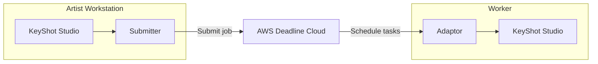
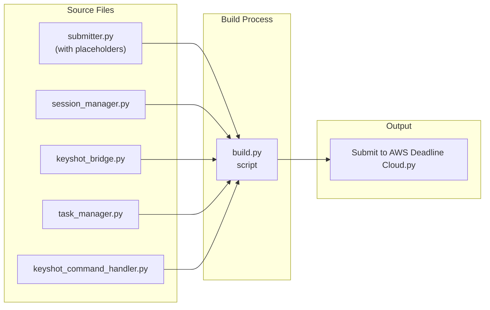
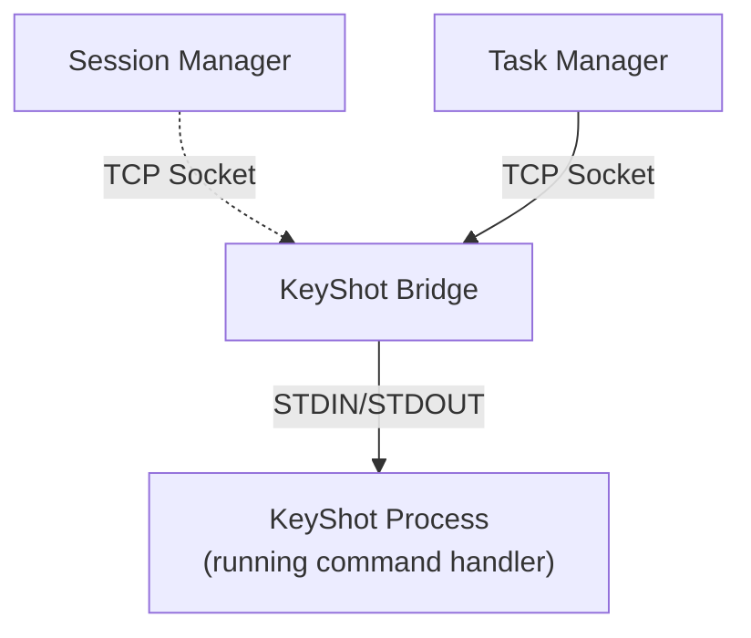
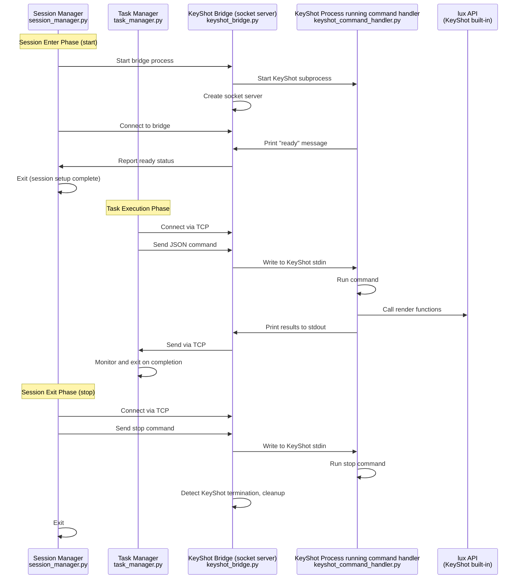

# Achitecture for AWS Deadline Cloud's KeyShot Studio integration

The AWS Deadline Cloud KeyShot integration consists of two main components: a **submitter** that runs inside KeyShot on the artist's workstation to create and submit render jobs, and an **adaptor** that runs on Deadline Cloud workers to execute KeyShot rendering tasks.



## Submitter

The submitter is a Python script that users can invoke from KeyShot's scripting console. The script is run by KeyShot's embedded Python interpreter which has access to the `lux` API. The submitter uses the `lux` API to extract scene information, manage file dependencies, and generate an OpenJobDescription job bundle. Once the bundle is generated, the script invokes the Deadline Client job bundle submitter (`deadline bundle gui-submit`) which presents the job submission dialog.

The submitter creates a job bundle which directly embeds several adaptor scripts required to run the job. `submitter.py` contains most of the submitter code, but with placeholders for the adaptor scripts. The `build.py` script reads each adaptor component file and injects their contents into placeholder strings within the job template's `embeddedFiles` sections.



## Adaptor

The KeyShot adaptor enables efficient rendering on Deadline Cloud workers by maintaining a persistent KeyShot session and sending render commands dynamically (instead of restarting the application for each frame). The adaptor also monitors the KeyShot process's standard output, converting progress and error information into structured OpenJobDescription messages for proper status reporting.

## Adaptor architecture

The adaptor consists of several scripts which coordinate to open the KeyShot process and dynamically
feed it commands to run.



### Component Specifications

#### 1. KeyShot Command Handler (`keyshot_command_handler.py`)

**Python interpreter**: KeyShot's Python interpreter  
**Lifecycle**: Runs entire session. Starts during step `onEnter`, ends during step `onExit`.
**Communication**: STDIN/STDOUT with KeyShot Bridge - reads newline-delimited JSON commands, outputs execution results and errors

**Responsibilities**:
- Maintains blocking read loop on STDIN for incoming JSON commands
- Parses and dispatches JSON commands to appropriate handler functions
- Provides access to KeyShot's `lux` API for rendering operations

#### 2. KeyShot Bridge (`keyshot_bridge.py`)

**Python interpreter**: System Python interpreter  
**Lifecycle**: Runs entire session. Starts during step `onEnter`, ends during step `onExit`.
**Communication**: TCP socket server + subprocess I/O pipes - hosts socket on dynamically discovered port, forwards data between clients and KeyShot process

**Responsibilities**:
- Manages KeyShot subprocess lifecycle and forwards I/O between socket clients and KeyShot
- Hosts TCP socket server with single client connection support
- Handles graceful cleanup of connections and subprocess on termination

#### 3. Session Manager (`session_manager.py`)

**Python interpreter**: System Python interpreter  
**Lifecycle**: Short running. Runs once during step `onEnter` and once during step `onExit`.
**Communication**: Subprocess management + socket client - uses command line arguments, connects to bridge via TCP

**Responsibilities**:
- **Start mode (start)**: Launches KeyShot Bridge and waits for session establishment within timeout, validates startup by monitoring for "KeyShot server is ready" message, exits successfully after session establishment (OpenJD requirement)
- **Stop mode (stop)**: Connects to existing bridge via TCP socket, sends JSON stop command to cleanly stop KeyShot server, handles cleanup

#### 4. Task Manager (`task_manager.py`)

**Python interpreter**: System Python interpreter  
**Lifecycle**: Runs for the duration of the task. Runs during task `onRun`.
**Communication**: TCP socket client - connects to bridge, sends JSON commands, monitors output

**Responsibilities**:
- Generates JSON render commands with frame-specific parameters and transmits to bridge
- Monitors KeyShot output for completion, progress, and error patterns using regex
- Handles task timeout scenarios and manages connection lifecycle

### Component Interaction Sequence



### JSON Command Protocol

The adaptor uses a JSON-based command protocol for communication between components:

#### Render Command
```json
{
  "command": "render",
  "frame": 5,
  "output_path": "/path/to/output.png",
  "output_format": "PNG",
  "render_device": "GPU",
  "override_render_device": true,
  "render_options": {
    "engine_anti_aliasing": 1,
    "progressive_max_samples": 100
  }
}
```

#### Stop Command
```json
{
  "command": "stop"
}
```


## Useful testing commands

1. **Build and install the submiter**. Submitter is installed and ready to run in KeyShot. No restart needed.

```bash
hatch run python src/build.py --output "/Library/Application Support/KeyShot Studio/Scripts/Submit to AWS Deadline Cloud.py"
```

2. **Submit a job from the CLI**. Uses the submitter in KeyShot to generate a job bundle for your scene, then submits the
job bundle using the Deadline CLI. Useful for debugging with AI agents.

```bash
# Configure known asset paths (one-time setup to avoid "unknown paths" error)
deadline config set settings.known_asset_paths "~/github/deadline-cloud-for-keyshot"

# Submit the job
hatch run python src/build.py --output "./dist/Submit to AWS Deadline Cloud.py" && \
rm -rf test-output && \
mkdir -p test-output && \
"/Applications/KeyShot Studio.app/Contents/MacOS/keyshot" -headless "./test/integ/cube/scene.bip" -script "./dist/Submit to AWS Deadline Cloud.py" --bundle ./test-output && \
echo "Y" | deadline bundle submit --yes ./test-output --max-retries-per-task 1

# Get the logs (replace job-XXXXX with the actual job ID returned from the submit command above)
deadline job logs --job-id job-XXXXX
```
